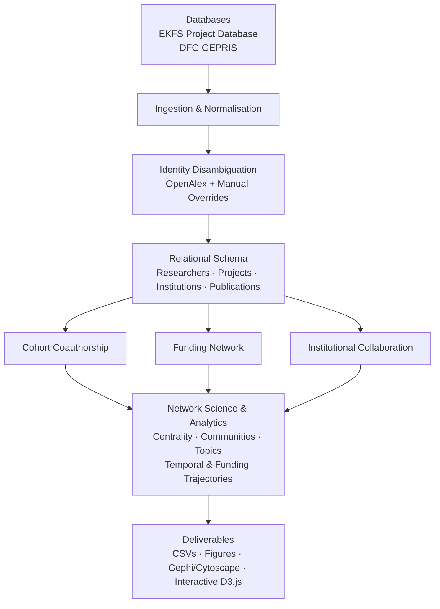

# Biomedical Research Funding & Collaboration Network Platform

[](https://opensource.org/licenses/MIT)
[]()
[]()

A reproducible bibliometric and network-analysis platform for studying relationships between biomedical researchers, projects, institutions, publications, and funding trajectories across the **Else Kröner-Fresenius-Stiftung (EKFS)** and **Deutsche Forschungsgemeinschaft (DFG)**.

The central question is:

> **How are EKFS- and DFG-funded biomedical researchers, projects, institutions, research topics, publications, and collaboration communities connected, and how do those relationships change across funding source and time?**

## Architecture



## What It Does

The pipeline combines EKFS and DFG funding records with OpenAlex bibliographic metadata to:

- normalize researchers, grants, institutions, and publications;
- resolve researcher identities using multiple signals and manual overrides;
- construct coauthorship, funding, and institutional collaboration networks;
- calculate centrality and community structure;
- analyse research topics and temporal collaboration patterns;
- derive longitudinal **EKFS ↔ DFG funding trajectories**;
- export publication-ready tables, figures, and interactive networks.

## Quick Start

Requirements:

- Python 3.10+
- R 4.2+ optional

Run the complete pipeline:

```bash
python3 scripts/run_pipeline.py
```

Run tests:

```bash
python3 tests/test_pipeline.py -v
```

Generate validation reports:

```bash
python3 scripts/generate_validation_report.py
```

## Outputs

Generated results are written under `outputs/`, including:

```text
outputs/
├── tables/
├── figures/
├── networks/
└── interactive/
```

Key outputs include normalized funding and publication tables, weighted network edge lists, researcher metrics, community summaries, funding trajectories, identity-resolution audits, Gephi/Cytoscape exports, and an interactive D3.js network.

## Methodological Notes

The analysis is **descriptive and observational**. Network structure or funding sequence must not be interpreted as evidence that particular collaborations, institutions, or prior grants caused later funding success.

Researcher matching uses OpenAlex, ORCID, affiliations, and other metadata and can therefore retain residual ambiguity. Manual corrections are supported through:

```text
data/processed/researcher_identity_overrides.csv
```

EKFS and DFG records represent the funding information captured from their respective databases; absence from the dataset does not prove absence of funding.

## License

Released under the **MIT License**. See `LICENSE`.